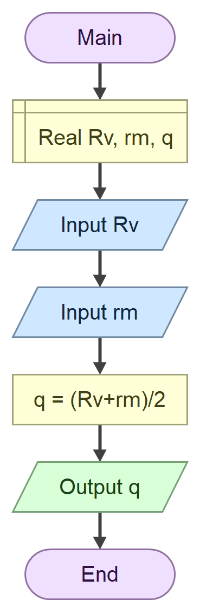

##Задатак

Програм који на основу унетих вредности **полупречника** већег круга R и **полупречника** 
мањег круга r израчунава **средњи полупречник** кружног прстена 𝜌.

$𝜌=\frac{Rv+rm}{2}$

### Алгоритамска шема



## Решење
```cs
using System;

namespace Domaci
{
    internal class Program
    {
        static void Main(string[] args)
        {
            Console.WriteLine("Unesi R");
            double Rv = double.Parse(Console.ReadLine());
            Console.WriteLine("Unesi r");
            double rm = double.Parse(Console.ReadLine());
            double q = (Rv + rm) / 2;
            Console.WriteLine("Resenje je " + q);
        }
    }
}

```
### Тест примери 

Пример 1:
``` text
Unesi R
10
Unesi r
8
Resenje je 9

C:\Users\dalib\source\repos\domaci\domaci\bin\Debug\domaci.exe (process 2556) exited with code 0 (0x0).
Press any key to close this window . . .
```

Пример 2:
```text
Unesi R
4.1
Unesi r
6.7
Resenje je 5.4

C:\Users\dalib\source\repos\domaci\domaci\bin\Debug\domaci.exe (process 27744) exited with code 0 (0x0).
Press any key to close this window . . .

```
###Објекти

| Редни број | објекат | тип    |
| ---------- | ------- | ---    |
|1.          |`Rv`     |`double`|
|2.          |`rm`     |`double`|
|3.          |`q`      |`double`|


